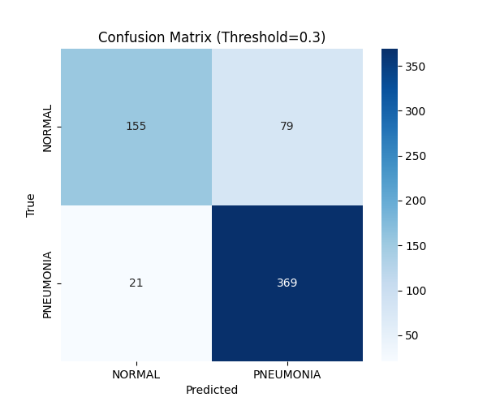

# Pneumonia Detection Model – Training and Evaluation

This repository contains the code and dataset used to **train and evaluate a deep learning model** for classifying chest X-ray images into two categories:
- **NORMAL**
- **PNEUMONIA**

The trained model is exported and used in the main application repository [`Chest_X-ray_Pneumonia_Image_Classification`](https://github.com/danyIkram/Chest_X-ray_Pneumonia_Image_Classification).

---

## 📊 Dataset

We used the publicly available **Chest X-Ray Images (Pneumonia)** dataset published on [Mendeley Data](https://data.mendeley.com/datasets/rscbjbr9sj/2).

- **NORMAL images:** 1,349  
- **PNEUMONIA images:** 3,884  
- **Note:** The dataset is **imbalanced** with more pneumonia cases than normal ones.

---

## 🧠 Model Summary

- **Input:** Chest X-ray images (resized before training)
- **Architecture:** Convolutional Neural Network (CNN)
- **Output:** Binary classification – NORMAL (0) or PNEUMONIA (1)

---

## 📈 Results

### Confusion Matrix

|                | Predicted NORMAL | Predicted PNEUMONIA |
|----------------|----------------|---------------------|
| **Actual NORMAL**   | **155** ✅          | **79** ❌               |
| **Actual PNEUMONIA**| **21** ❌           | **369** ✅              |

- **True Positives (Pneumonia detected correctly):** 369  
- **True Negatives (Normal detected correctly):** 155  
- **False Positives (Normal misclassified as Pneumonia):** 79  
- **False Negatives (Pneumonia missed):** 21

  

### Interpretation

- The model performs well on pneumonia cases (high recall for pneumonia).
- There is a moderate number of false positives (NORMAL misclassified as PNEUMONIA), likely due to dataset imbalance.
- This means the model is **sensitive** (catches most pneumonia cases) but **less specific** (some normal images are flagged as pneumonia).

